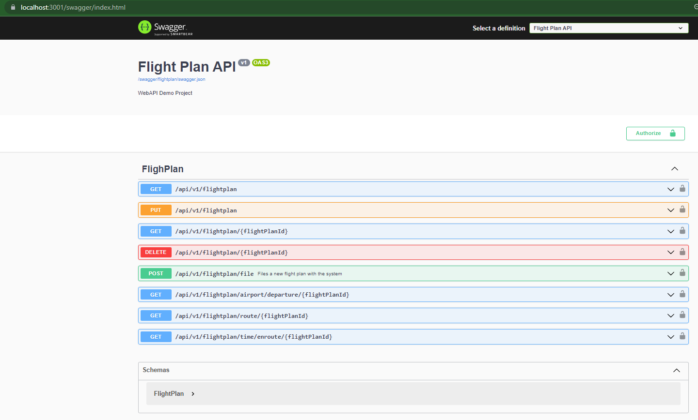

# FlightPlan API

## Running
Running the databases

```./rundb.sh```

Sample output:
```
 ✔ Container flightplan-mongo-1    Created                                                                         0.0s
 ✔ Container flightplan-mongoui-1  Created
```

### MongoDB UI
> http://localhost:8081


Running the API Service

```./runservices.sh```

Sample output:
```
[+] Running 1/1
 ✔ Container flightplan-api-1  Recreated                                                                           0.1s
Attaching to flightplan-api-1
```

### Swagger UI
> https://localhost:3001/swagger/index.html




> Use the flightplans.json to load some data